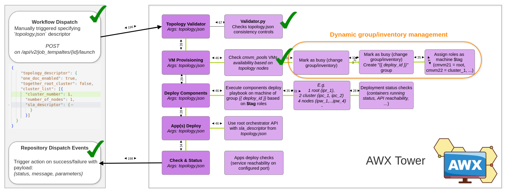
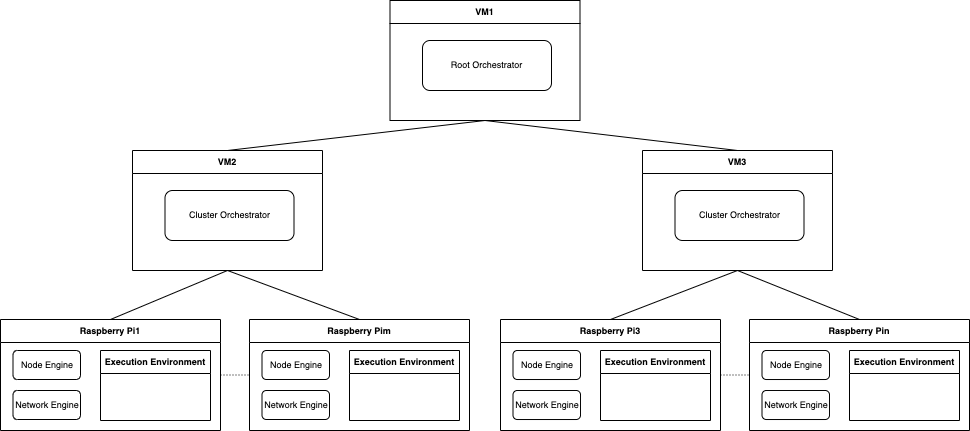

# AWX Testbed Draft


The overall pipeline of execution can be manually triggered directly on GitHub Actions (*provided the correct configuration by [on_push.yml](.github/workflows/on_push.yml)*), specifying which topology file (*e.g. [topology.json](topology.json)*) we want to deploy. The long-term goal is to have several topology descriptor that allows to automatically test different type of deploy (*multiple nodes, multiple clusters, specific application requirements, etc*) and at the same time provide a mechanism to create easily new topology to be executed on the testbed.

The Github Action Workflow Dispatch execute an API request to `$secrets.TOWER_HOST`, requiring the authentication token to further call `http://$TOWER_HOST/api/v2/job_templates/$TEMPLATE_ID/launch/`. In this context, the `$TEMPLATE_ID` is stored as a secret on Github and provide the Job ID to initialize the sequence of action that will be executed on AWX Tower side.

Currently, the playbooks retrieve the specified topology from the testbed repository and validate the topology definition sintactically and semantically (*e.g. coherent number of nodes and cluster, if ONEDOC deployment, partial deployment by root and cluster on same host, etc*). Further extension of this mechanism involves also the possibility (*e.g. on Github Action?*) to specify a specific branch and commit version of Oakestra to be tested on the AWX testbed.

Currently, the structure of the topology descriptor is very simple and mostly remarks the one behind the SLA descriptor. The following topology descriptor:
```json
{
    "topology_descriptor": {
    "one_doc_enabled": false, 
    "together_root_cluster": false,
    "cluster_list": [{
      "cluster_number": 1,
      "number_of_nodes": 2,
      "sla_descriptor": {
          "sla_version" : "v2.0",
          "customerID" : "Admin",
          "applications" : [
            {
              "applicationID" : "",
              "application_name" : "clientsrvr",
              "application_namespace" : "test",
              "application_desc" : "Simple demo with curl client and Nginx server",
              "microservices" : [
                {
                  "microserviceID": "",
                  "microservice_name": "curl",
                  "microservice_namespace": "test",
                  "virtualization": "container",
                  "cmd": ["sh", "-c", "curl 10.30.55.55 ; sleep 5"],
                  "memory": 100,
                  "vcpus": 1,
                  "vgpus": 0,
                  "vtpus": 0,
                  "bandwidth_in": 0,
                  "bandwidth_out": 0,
                  "storage": 0,
                  "code": "docker.io/curlimages/curl:7.82.0",
                  "state": "",
                  "port": "",
                  "added_files": [],
                  "constraints":[]
                },
                {
                  "microserviceID": "",
                  "microservice_name": "nginx",
                  "microservice_namespace": "test",
                  "virtualization": "container",
                  "cmd": [],
                  "memory": 100,
                  "vcpus": 1,
                  "vgpus": 0,
                  "vtpus": 0,
                  "bandwidth_in": 0,
                  "bandwidth_out": 0,
                  "storage": 0,
                  "code": "docker.io/library/nginx:latest",
                  "state": "",
                  "port": "80:80/tcp",
                  "addresses": {
                    "rr_ip": "10.30.55.55"
                  },
                  "added_files": []
                }
              ]
            }
          ]
        }
      },
      {
	      "cluster_number": 1,
	      "number_of_nodes": 2,
	      "sla_descriptor": { ... 
      }]
  }
}


```
Describe the following deployment configuration (*currently, not considering the hardware specification*):



If any of the steps described in the first image fail, the failure is reported to Github Action invoked by AWX Tower (*specified in the [repository dispatch event](.github/workflows/repository-dispatch.yml)*). 

### *Current status - Update of 04.07.2024*
- *Debugging machine group status*: dynamically change the assigned group of the available machine (to *reserve* them and use in the deploy) is not working. A different approach is being evaluated by tagging the `busy` machines. Require further investigation.

- *A fine-grained communication between AWX and Github should be evaluated*: new execution of a topology descriptor on testbed should be uniquely identified. This ID should be considered also on Github side to distinguish between different deploy at the same time. At same time, before triggering the action, should be possible to specify the `BRANCH` and `COMMIT`version to retrieve from Oakestra repo.
- *Restructure the playbooks and repo folder structure*: for clarity the same structure of [automation repo](https://github.com/oakestra/automation) has been reused as partially some roles and playbooks can be re-used for the deployment of the Oakestra components. A clearer structure is needed after testing all the required steps.
- *Required secret configuration*: on Github side, it's necessary to configure:
	- `TEMPLATE_ID`: `11`
	- `TOWER_HOST`: `131.159.25.106`
	- `TOWER_PASS`: `password`
    - `TOWER_USER` `admin`

    On AWX Tower side:
    - `GITHUB_API_TOKEN`: access token to authorize repository dispatch callback from AWX to Github
