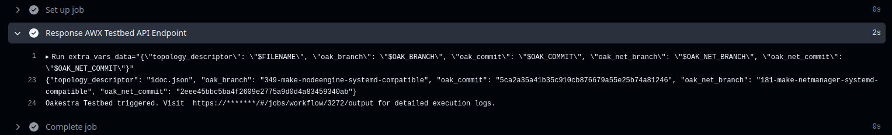
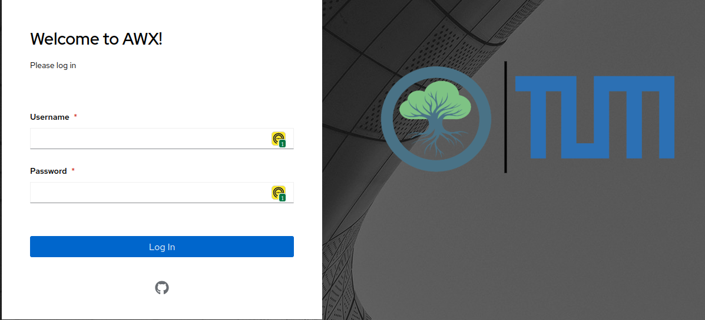
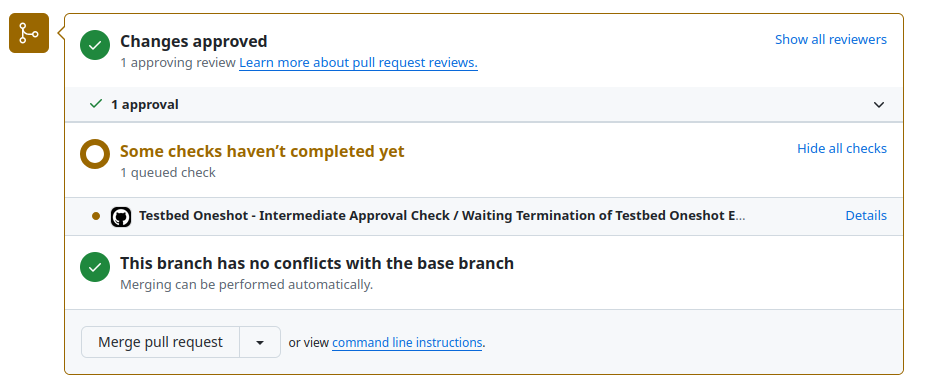
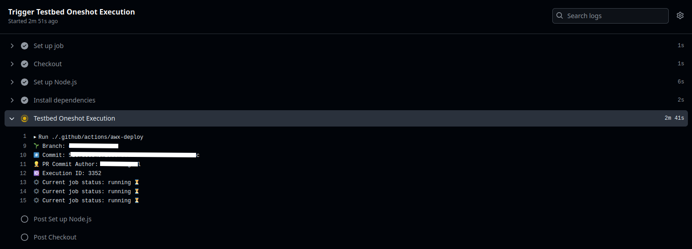
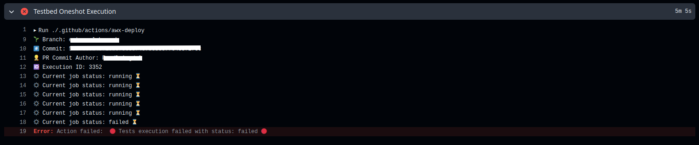
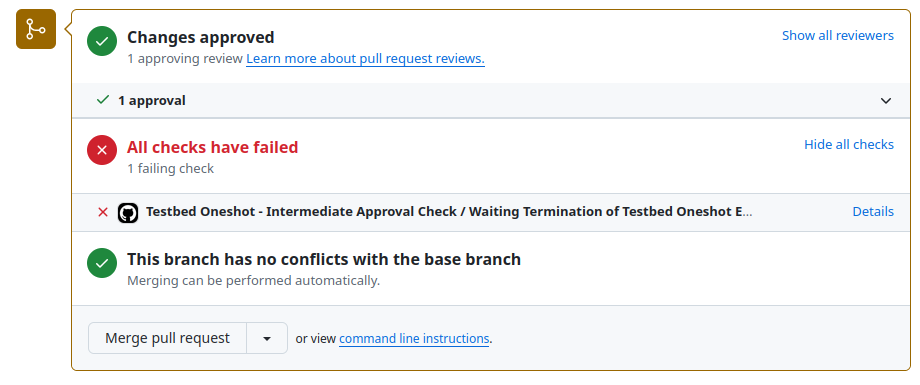

# [⚙️ Oakestra Virtual Testbed](https://github.com/oakestra/awx-testbed)

The primary objective of this repository is to offer Oakestra maintainers and contributors a CI-integrated tool for automating component deployment, configuration, application deployment, and result assessment across a range of predefined and customizable use cases and scenarios.
To achieve this, two execution modes have been identified:

- **Custom Execution**: Available to maintainers of the Oakestra repository with write access, enabling them to test specific scenarios against particular versions of Oakestra and Oakestra-Net.
- **Oneshot Execution**: Integrated into the CI pipeline, it runs a predefined set of scenarios for each approved PR review, providing a pass/fail status based on the success of the deployment and tests.

Although the two execution modes share common elements, their differing behavior necessitates separating the testbed into two branches: `custom` for Custom Execution and `oneshot` for Oneshot Execution.

## Topology Descriptor
By *use cases* or *scenarios*, we mean a specific configuration of multiple nodes, which can function as root, cluster, or worker nodes, and have applications deployed on them with defined constraints regarding where these deployments should occur. 

To facilitate this, we introduced the concept of a **Topology Descriptor** *(TD)*, a JSON file that specify which deployment mode execute among *1-DOC (One device, One Cluster), M-DOC (*$M$ *Devices, One Cluster)* and *MDNC (*$M$ *Devices,* $N$ *Clusters)*. For more information about deployment mode, please refer [Create your first cluster](https://www.oakestra.io/docs/getstarted/get-started-cluster/#create-your-first-oakestra-cluster). 

So a *TD* add meta-information to one or more [Deployment Descriptor](https://www.oakestra.io/docs/getstarted/get-started-app/#deployment-descriptor)(s), slightly modifying it temporarly for testing purpose, as we will explain later.

### Anatonomy of a Topology Descriptor
The general struscture of a *TD* is the following, mostly shared with the structure of a Deployment Descriptor:
```json
{
  "topology_descriptor": {
    "onedoc": "boolean", 
    "mdoc": "boolean",
    "cluster_list": [
      {
        "cluster_number": "integer", 
        "workers_number": "integer",
        "sla_descriptor": {
          "sla_version": "string", 
          "customerID": "string",
          "applications": [
            {
              "applicationID": "string", 
              "application_name": "string", 
              "application_namespace": "string",
              "application_desc": "string",
              "microservices": [
                {
                  "microserviceID": "string", 
                  "microservice_name": "string", 
                  "microservice_namespace": "string",
                  "virtualization": "string", 
                  "cmd": ["array of strings"], 
                  "expected_output": "string", 
                  "memory": "integer", 
                  "vcpus": "integer", 
                  "vgpus": "integer", 
                  "vtpus": "integer", 
                  "bandwidth_in": "integer", 
                  "bandwidth_out": "integer", 
                  "storage": "integer", 
                  "code": "string", 
                  "state": "string", 
                  "port": "string", 
                  "added_files": ["array of strings"],
                  "constraints": ["array of strings"]
                }
              ]
            }
          ]
        }
      }
    ]
  }
}

```
Let's describe the meaning of the fields introduced by the *TD*:

- **`onedoc`**: If `true`, provisions the infrastructure to deploy and test the component on a single node.
- **`mdoc`**: If `true`, provisions the infrastructure to deploy the Root and Cluster Orchestrator on a single node, and provisions $M$ additional nodes.
  - If both `onedoc` and `mdoc` are `false`, the assumed scenario is `mdnc`.
- **`cluster_list`**: Contains the list of clusters to be deployed, based on the previous two flags. It includes three key pieces of information:
  - **`cluster_number`**: An integer identifying the specific cluster.
  - **`workers_number`**: An integer specifying the number of worker nodes to deploy in the cluster (assigned if enough hosts are available).
    - ℹ️ Within the same cluster, if `workers_number` is greater than 1, applications are deployed on specific worker nodes using a round-robin assignment, where each application is assigned to a worker node in turn.  
If there is only one application, its microservices are distributed across the worker nodes using the same round-robin assignment policy.

 - **`sla_descriptor`**: Contains the same information as the [Deployment Descriptor](https://www.oakestra.io/docs/getstarted/get-started-app/#deployment-descriptor), with an additional field, `expected_output`, used only by the testbed. This field is not required or used by Oakestra and is removed before deploying the related applications. It allows the testbed to compare the logs of specific microservices against the defined `expected_output`, serving as a basic health check for the microservice.

## Usage

### 1. Custom Execution 🔬
Mantainers that have write access to oakestra repository can find under *Actions* tab in Github the corresponding action called "**Execute Custom Testbed Workflow Pipeline**". Click on *Run Workflow* will make appear the following box:


The execution of a **forked repository** from a specific branch `$USERNAME:$BRANCH` is permitted by specifying the `$BRANCH` name as the branch (for either Oakestra or Oakestra-net) and providing a **specific commit** (e.g., the latest commit hash of `$BRANCH`).

⚠️ Leaving `HEAD` for the branch execution of a forked repository will cause the execution to fail.


To not expose internal information publicly, the output of the triggered workflow will only print the reference to on the Testbed for check the specific logs of the testbed. The action uses the AWX API to trigger the execution of the corresponding Workflow Job Template on AWX:



The specific log will refer to the output of the **🔬 [Custom] Oakestra Testbed Execution Pipeline** workflow job template on the AWX Dashboard. Oakestra maintainers can access the logs using their GitHub account associated with the Oakestra Organization by clicking on the GitHub icon:





For more details about the custom execution, refer the [custom documentation README ](https://github.com/oakestra/awx-testbed/tree/custom).

---
### 2. Oneshot Execution 🎯
This execution mode is triggered when a PR review is approved by one of the reviewers, triggering two action on [oakestra]() repository, one visible directly in the PR section, as shown:



And one running in background: this second Action is reacheable under *Actions* section of Github, under the name *"Testbed Oneshot - Multiple Scenarios Test Deployment"*, reporting the execution details and the execution status:



The first action, named *Waiting Cycle*, has been introduced to avoid sharing any repository secret with external/forked repository. The actual output of the execution is represented by the log of the second action, namely *Oneshot Execution*. When this second action fail:


The corresponding *Waiting Cycle* report the failure under the PR section:


ℹ️  The full execution logs are not available to maintainers because the oneshot execution triggers a different workflow job template compared to custom execution. The output is accessible only to administrator accounts.

For more details about the oneshot execution, refer the [oneshot documentation README ](https://github.com/oakestra/awx-testbed/tree/oneshot).