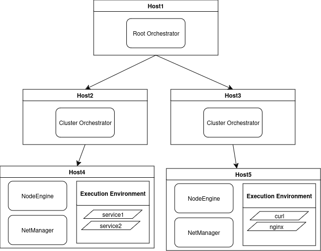

# AWX Testbed Design Draft

The Oakestra Testbed Execution Pipeline relies on the Ansible AWX infrastructure, reacheable on the controller node, currently [**** REDACTED *****](http://redacted).

The previous image depict the high-level communication architecture between the AWX controller host and the Github Action pipeline. The pipeline execution can be manually triggered directly on GitHub Actions, specifying:
- A **topology descriptor** file, to be located under `/topologies` folder
- An *Oakestra repository **branch***
- An *Oakestra repository **commit***

The topology descriptor (*e.g. [1doc.json](/topologies/1doc.json)*) is a simplified description of a deployment scenarios based on the base **SLA Descriptor**, defining the configuration mode among *1-DOC (One Device, One cluster)*, *M-DOC ($M$ Devices, One Cluster)* and *MDNC ($M$ Devices, $N$ Clusters)*. Other information such the number of clusters and the number of worker nodes per cluster to effectively provision and execute the described configuration.

The [topologies](/topologies/) folder contains several basic topology descriptor to use as base schema for custom deployments.

Both the repository **branch** and repository **commit** are custom optional parameters that allows to execute a specific branch/commit of Oakestra repository. Further custom parameter may be introduced in the future to allows custom version of *oakestra-net* repository, custom execution of worker nodes, etc.

### 🏗️ Topology Descriptor Structure


Currently, the structure of the topology descriptor is very simple and mostly remarks the one behind the [SLA deployment descriptor](https://github.com/oakestra/oakestra?tab=readme-ov-file#-deployment-descriptor). The following topology descriptor correspond to [2 Devices, 2 Cluster topology](./topologies/2d2c.json):
```json
{
    "topology_descriptor": {
    "one_doc_enabled": false, 
    "together_root_cluster": false,
    "cluster_list": [
      {
        "cluster_number": 2,
        "number_of_nodes": 1,
        "sla_descriptor": {
            "sla_version" : "v2.0",
            "customerID" : "Admin",
            "applications" : [
              {
                  "applicationID" : "",
                  "application_name" : "newapp",
                  "application_namespace" : "test2",
                  "application_desc" : "New application with two long-running services",
                  "microservices" : [
                    {
                      "microserviceID": "",
                      "microservice_name": "service1",
                      "microservice_namespace": "test1",
                      "virtualization": "container",
                      "cmd": ["sh", "-c", "while true; do echo 'Service 1 running'; sleep 60; done"],
                      "memory": 1,
                      "vcpus": 0,
                      "vgpus": 0,
                      "vtpus": 0,
                      "bandwidth_in": 0,
                      "bandwidth_out": 0,
                      "storage": 0,
                      "code": "docker.io/library/alpine:latest",
                      "state": "",
                      "port": "",
                      "added_files": []
                    },
                    {
                      "microserviceID": "",
                      "microservice_name": "service2",
                      "microservice_namespace": "test2",
                      "virtualization": "container",
                      "cmd": ["sh", "-c", "while true; do echo 'Service 2 running'; sleep 60; done"],
                      "memory": 1,
                      "vcpus": 0,
                      "vgpus": 0,
                      "vtpus": 0,
                      "bandwidth_in": 0,
                      "bandwidth_out": 0,
                      "storage": 0,
                      "code": "docker.io/library/alpine:latest",
                      "state": "",
                      "port": "",
                      "added_files": []
                    }
                  ]
                }
            ]
          }
      },
      {
        "cluster_number": 1,
        "number_of_nodes": 1,
        "sla_descriptor": {
            "sla_version" : "v2.0",
            "customerID" : "Admin",
            "applications" : [
              {
                "applicationID" : "",
                "application_name" : "clientsrvr1",
                "application_namespace" : "test1",
                "application_desc" : "Simple demo with curl client and Nginx server",
                "microservices" : [
                  {
                    "microserviceID": "",
                    "microservice_name": "curl",
                    "microservice_namespace": "test1",
                    "virtualization": "container",
                    "cmd": ["sh", "-c", "curl 10.30.55.55 ; sleep 5"],
                    "memory": 1,
                    "vcpus": 1,
                    "vgpus": 0,
                    "vtpus": 0,
                    "bandwidth_in": 0,
                    "bandwidth_out": 0,
                    "storage": 0,
                    "code": "docker.io/curlimages/curl:7.82.0",
                    "state": "",
                    "port": "",
                    "added_files": []
                  },
                  {
                    "microserviceID": "",
                    "microservice_name": "nginx",
                    "microservice_namespace": "test1",
                    "virtualization": "container",
                    "cmd": [],
                    "memory": 1,
                    "vcpus": 1,
                    "vgpus": 0,
                    "vtpus": 0,
                    "bandwidth_in": 0,
                    "bandwidth_out": 0,
                    "storage": 0,
                    "code": "docker.io/library/nginx:latest",
                    "state": "",
                    "port": "80:80/tcp",
                    "addresses": {
                      "rr_ip": "10.30.55.55"
                    },
                    "added_files": []
                  }
                ]
              }
            ]
          }
      }]
  }
}


```
Aside from the `sla_descriptor`, from the previous JSON the relevant fields are the boolean flags at the top of the file that specify the type of deployment (*1-DOC, M-DOC, MDNC*), the `cluster_list` which define how many clusters and how many worker nodes are assigned to each cluster. 
Based on the number of worker nodes assigned to each cluster, a round-robin assignation between application/microservices is applied. 

The provided JSON deploy assign both the microservices of `cluster2.newapp` to the worker assigned to `cluster2`, assume it to be `worker2`. The same happens for the microservices of `cluster1.clientsrvr1`, assigned to `worker1`. 
If differently, the `cluster1` had 2 worker nodes assigned, each microservice inside `cluster1.clientsrvr1` would be assigned respectively to `worker1` and `worker2`. 

Describe the following deployment configuration (*currently, not considering the hardware specification*):


## 📨 Pipeline Execution Phases (*WIP 🚧*)


After triggering the workflow from *"Github Action > Execute Testbed Workflow Pipeline"*, the pipeline retrieve the specified *topology descriptor* and execute the **1. topology validator** phase to check the syntax correctness and semantical coherency (*e.g. 1DOC descriptor with multiple cluster should be rejected at this step*). 

The **2. host provisioning** phase determine if the required topology can be deployed based on the number of available hosts, and if available, mark the nodes as `busy`.

The **3. component deployment** phase differentiates between the three available scenarios (1DOC, M-DOC, MDNC), determining the role of each designated host based on the topology. It then proceeds to build and compile the necessary services for each node type (root, cluster, or worker).

This phase is the most time-intensive and error-prone due to potential challenges such as latency and connectivity issues, package repository updates, and conflicts with already-running processes. Potential failure during this phase does not interrupt the pipeline execution to allows deeper debugging by log inspection and exporting (*see later, \#TBR*), 

The **4. services healthcheck** phase perform minimal and light checks on the execution status of the components, respectively check that the declared containers are running for root/clusters hosts and check if `NetManager` and/or `NodeEngine` processes are running on target worker hosts, inspecting the logs to detect potential error statuses. Differently from the previous phase, the failure of this phase interrupt the execution pipeline.

Finally, if the previous phase suceeed, the **5. SLA deploy \& healthcheck** phase proceed to deploy the application specified in each `sla_descriptor` of the *topology descriptor* by relying on the Oakestra Root API available at [http://SYSTEM_MANAGER_URL:10000/api/docs/](http://SYSTEM_MANAGER_URL:10000/api/docs/). 


If any of the steps described in the first image fail, the failure is reported to Github Action invoked by AWX Tower (*specified in the [repository dispatch event](.github/workflows/repository-dispatch.yml)*). 

### 🆕 To-Be-Addressed \& further improvements
- [✅ ]:  *Debugging machine group status*: dynamically change the assigned group of the available machine (to *reserve* them and use in the deploy) is not working. A different approach is being evaluated by tagging the `busy` machines. Require further investigation. 
    - Currently solved by creating group at runtime. Status is mantained by the `OAK_STATUS` and `OAK_ROLE` environment variables, allowing to create the groups of available machines at runtime. Long-term solution involves create an external unique source of truth (*API endpoints for machine status storage and execution tracking + [dynamic inventory scripts](https://docs.ansible.com/ansible-tower/latest/html/administration/custom_inventory_script.html#writing-inventory-scripts)*) that allows to mantain status and track each testedbed pipeline execution, evaluating e.g. machine constraints, machine type (Virtual/Device) time to deploy per components, recover logs for different execution, direct interaction with deployed apps/functional evaluation of deployed components

- [⚠️/✅] *A fine-grained communication between AWX and Github should be evaluated*: new execution of a topology descriptor on testbed should be uniquely identified. This ID should be considered also on Github side to distinguish between different deploy at the same time. At same time, before triggering the action, should be possible to specify the `BRANCH` and `COMMIT`version to retrieve from Oakestra repo.
  - ✅ : Required information specified
  - ⚠️: *Execution tracking TBR, see point before*
- [✅]*Restructure the playbooks and repo folder structure*: for clarity the same structure of [automation repo](https://github.com/oakestra/automation) has been reused as partially some roles and playbooks can be re-used for the deployment of the Oakestra components. A clearer structure is needed after testing all the required steps.
    - : Folder structure in `playbooks` and `roles` is compliant to AWX remote retrieval of playbooks to execute, allowing extensibility of Workflow Job Template by scheduled/automatic import from remote. Support folders has been introduced:
      - `topologies/`: containing the default topology descriptor available to be deployed
      - `utils/`: containing the execution support used for topology validation, cluser-worker matching, app deploy throught API, etc (*ndr. suggested by [John Barker](https://github.com/gundalow), Ansible Team*)


### 📚 Configuration \#TBR
- *Required secret configuration*: on Github side, it's necessary to configure:
	- `TEMPLATE_ID`: `11`, Workflow Job Template ID to trigger the pipeline
	- `TOWER_HOST`: `131.159.25.106`,  *controller machine*
	- `TOWER_PASS`: `password`
    - `TOWER_USER` `admin`

    On AWX Tower side:
    - `GITHUB_API_TOKEN`: access token to authorize repository dispatch callback from AWX to Github (*ndr, disabled during test phase)


The Github Action Workflow Dispatch execute an API request to `$secrets.TOWER_HOST`, requiring the authentication token to further call `http://$TOWER_HOST/api/v2/job_templates/$TEMPLATE_ID/launch/`. In this context, the `$TEMPLATE_ID` is stored as a secret on Github and provide the Job ID to initialize the sequence of action that will be executed on AWX Tower side.


